# Movie ID 🎬

Movie ID is a full-stack web application designed to solve a very common problem: finding the name of a movie or TV show from a viral YouTube Short when no one drops the title in the comments. 

Simply paste the YouTube Short link into the app, and it will download the video, use Google's advanced Gemini 2.5 Flash AI to watch the clip and identify the movie, and finally scour the web to provide official streaming links (Netflix, Amazon, Hulu, Apple TV, etc.).

## 🏗 Architecture & Flow Diagram

The application uses a **Next.js** frontend with a premium glassmorphic UI, and a **FastAPI** Python backend to handle the heavy lifting (video downloading, AI processing, and web search).

```mermaid
sequenceDiagram
    participant User
    participant Next.js Frontend
    participant FastAPI Backend
    participant yt-dlp (Downloader)
    participant ZenRows (Proxy)
    participant Gemini 2.5 Flash
    participant Tavily Search

    User->>Next.js Frontend: Pastes YouTube Short URL
    Next.js Frontend->>FastAPI Backend: POST /api/identify-movie { url }
    
    rect rgb(30, 33, 40)
        Note over FastAPI Backend, yt-dlp (Downloader): Video Acquisition
        FastAPI Backend->>yt-dlp (Downloader): Request video download
        yt-dlp (Downloader)->>ZenRows (Proxy): Bypass CAPTCHAs & 403 Forbidden
        ZenRows (Proxy)-->>yt-dlp (Downloader): Returns video stream
        yt-dlp (Downloader)-->>FastAPI Backend: Saves temporary .mp4 file
    end

    rect rgb(30, 33, 40)
        Note over FastAPI Backend, Gemini 2.5 Flash: AI Identification
        FastAPI Backend->>Gemini 2.5 Flash: Upload .mp4 & query prompt
        Gemini 2.5 Flash-->>FastAPI Backend: Returns JSON { title, year }
        FastAPI Backend->>FastAPI Backend: Deletes local .mp4
        FastAPI Backend->>Gemini 2.5 Flash: Delete video from Google Servers
    end

    rect rgb(30, 33, 40)
        Note over FastAPI Backend, Tavily Search: Streaming Links Search
        FastAPI Backend->>Tavily Search: Search "Where to watch [Title] [Year]"
        Tavily Search-->>FastAPI Backend: Returns official streaming URLs
    end

    FastAPI Backend-->>Next.js Frontend: Returns Movie details & Links
    Next.js Frontend-->>User: Renders beautiful Movie Result UI
```



## 🚀 Tech Stack

- **Frontend:** Next.js (App Router), React, Tailwind CSS, TypeScript
- **Backend:** Python 3.11, FastAPI, Uvicorn
- **Video Processing:** `yt-dlp` for downloading YouTube Shorts
- **Proxy/Bot Bypass:** Built to support ZenRows / Scrape.do proxy integration to bypass YouTube's `403 Forbidden` and CAPTCHAs.
- **AI Model:** Google Gemini 2.5 Flash (handles video context natively)
- **Web Search Engine:** Tavily Search API

## 🛠 Local Setup Instructions

### 1. Backend Setup (FastAPI)

Navigate to the `backend` directory and set up the Python environment:

```bash
cd backend
py -3.11 -m venv venv
.\venv\Scripts\Activate.ps1
pip install -r requirements.txt
```

Create a `.env` file in the `backend` folder with your API keys:
```env
GOOGLE_API_KEY=your_gemini_api_key
TAVILY_API_KEY=your_tavily_api_key
ZENROWS_API_KEY=your_zenrows_proxy_key
```

Run the backend server:
```bash
uvicorn main:app --reload --port 8000
```

### 2. Frontend Setup (Next.js)

Open a new terminal, navigate to the `frontend` directory, install dependencies, and start the development server:

```bash
cd frontend
npm install
npm run dev
```

Visit `http://localhost:3000` in your browser to use the application!

## 🧹 Strict Cleanup

The application is built with automatic cleanup mechanisms to ensure your server storage isn't filled with downloaded YouTube Shorts. 
- The local `.mp4` file is aggressively deleted via a `finally` block in FastAPI immediately after the request ends (success or fail).
- An API call is sent to Google to immediately delete the uploaded video from Gemini's server storage, preventing you from hitting storage limits.
